# Portfolio Backend Infrastructure — AWS + Terraform

<p align="center">
  
  
  
  
  
  
</p>

Terraform infrastructure for running a small, production-shaped portfolio backend on one Amazon EC2 instance. AWS provides the network, compute, static public IP, instance identity, and remote administration. Docker Compose runs the application stack. Nginx is the only public application entry point, Certbot manages TLS, and a Backend for Frontend (BFF) isolates two internal microservices from the Internet.

The Compose definition contains five services: `nginx`, `certbot`, `bff`, `language-service`, and the new `stats-service`. Four are long-running; Certbot runs on demand for certificate issuance and renewal.

> Public application endpoint: `https://api-portfolio.zapto.org`
>
> Repository status: this document describes the configuration currently present in the working tree. The local Terraform state proves that the AWS foundation has been managed from this project, but it does not prove that every un-applied working-tree change is already running in AWS.

## Contents

- [System overview](#system-overview)
- [Request path](#request-path)
- [AWS infrastructure](#aws-infrastructure)
- [Container runtime](#container-runtime)
- [Internal services](#internal-services)
- [Docker network isolation](#docker-network-isolation)
- [Configuration model](#configuration-model)
- [EC2 bootstrap](#ec2-bootstrap)
- [TLS lifecycle](#tls-lifecycle)
- [Security model](#security-model)
- [Repository layout](#repository-layout)
- [Requirements](#requirements)
- [Configure and deploy](#configure-and-deploy)
- [Outputs](#outputs)
- [Operations runbook](#operations-runbook)
- [Troubleshooting](#troubleshooting)
- [How changes are delivered](#how-changes-are-delivered)
- [Current implementation notes](#current-implementation-notes)
- [Limitations and roadmap](#limitations-and-roadmap)
- [Design decisions](#design-decisions)

## System overview

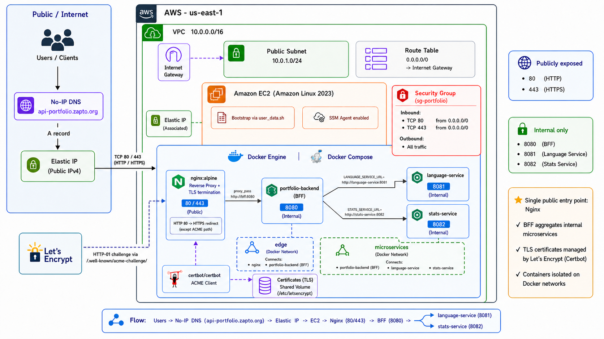

The system is intentionally compact: all application containers share one EC2 host, while network boundaries ensure that only Nginx is reachable from the public Internet.

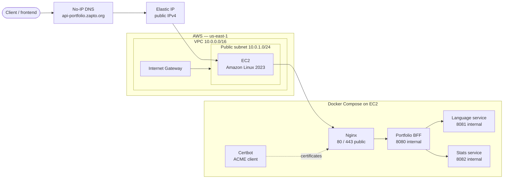

### Architecture at a glance

| Layer | Components | Responsibility |
|---|---|---|
| External | Clients, No-IP DNS, Let's Encrypt | Name resolution, API access, and certificate issuance |
| AWS network | VPC, public subnet, Internet Gateway, route table | Public IPv4 connectivity for the host |
| AWS security and identity | Security Group, IAM role, instance profile, SSM | Traffic filtering and administration without public SSH |
| AWS compute | EC2, encrypted `gp3` root volume, Elastic IP | Single-host runtime with a stable public address |
| Edge runtime | Nginx and Certbot | HTTP-to-HTTPS redirect, TLS termination, reverse proxy, and renewal |
| Application runtime | BFF, language service, stats service | Public API aggregation and private domain functionality |

## Request path

A normal API request enters through one controlled path. There is no direct public route to the BFF or either microservice.

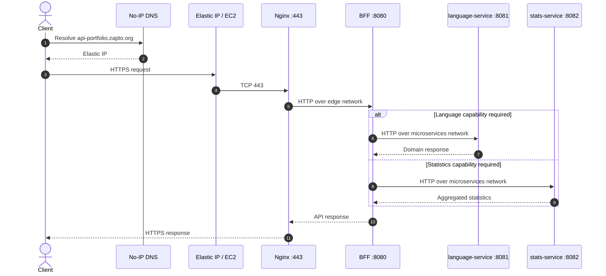

1. No-IP resolves `api-portfolio.zapto.org` to the Terraform-managed Elastic IP.
2. The EC2 Security Group accepts public IPv4 traffic only on TCP `80` and `443`.
3. Nginx redirects ordinary HTTP traffic to HTTPS and terminates TLS on `443`.
4. Nginx proxies the request to the BFF through the Docker `edge` network.
5. The BFF calls `language-service` or `stats-service` through the private `microservices` network.
6. Internal services return their result through the BFF; they never accept a direct Internet request.

Port `80` remains available for the ACME HTTP-01 challenge under `/.well-known/acme-challenge/`.

## AWS infrastructure

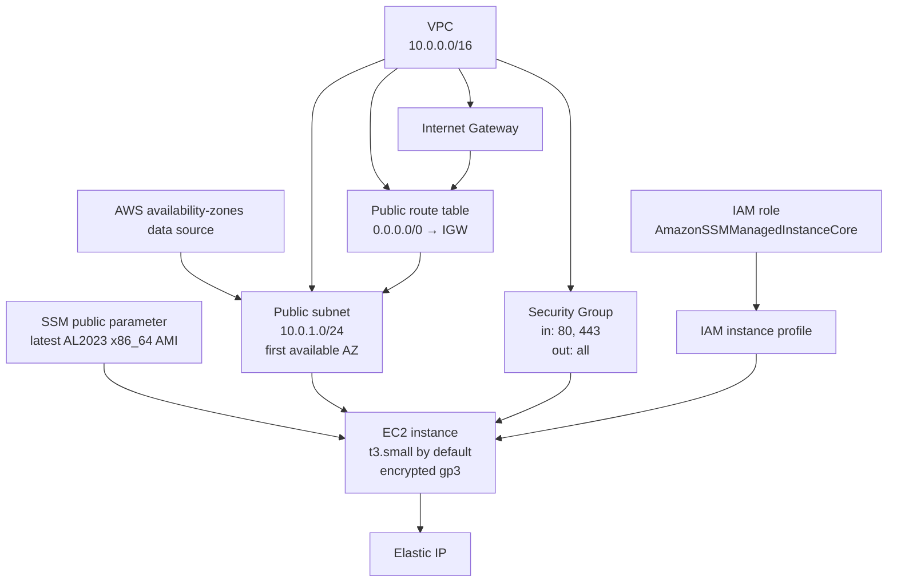

### Resource inventory

| Resource | Current configuration |
|---|---|
| Provider | AWS `6.60.0`; region from `var.aws_region`, default `us-east-1` |
| Default tags | `Project = var.project_name`, `Environment = production`, `ManagedBy = terraform` |
| VPC | `10.0.0.0/16`, DNS support and DNS hostnames enabled |
| Internet Gateway | Attached to the project VPC |
| Public subnet | `10.0.1.0/24`, first available AZ, public IP assignment enabled |
| Route table | Default IPv4 route `0.0.0.0/0` through the Internet Gateway |
| Security Group | Public TCP `80` and `443`; unrestricted IPv4 egress |
| AMI lookup | `/aws/service/ami-amazon-linux-latest/al2023-ami-kernel-default-x86_64` |
| EC2 | `t3.small` by default, public subnet, public IPv4 plus associated EIP |
| Root volume | `20 GiB` by default, `gp3`, encrypted, deleted on termination |
| Metadata | Instance Metadata Service enabled; IMDSv2 tokens required |
| IAM | Dedicated EC2 role and instance profile with `AmazonSSMManagedInstanceCore` |
| Elastic IP | Associated directly with the EC2 instance after the Internet Gateway exists |

The AMI is discovered dynamically for new instances. Terraform ignores later AMI drift on an existing instance, so a newly published Amazon Linux image alone does not replace the server.

The project currently uses a single public subnet and a single Availability Zone. There is no load balancer, NAT Gateway, Auto Scaling Group, or private EC2 subnet.

## Container runtime

`scripts/user_data.sh` renders the Compose definition and Nginx configuration into the deployment directory, `/opt/portfolio` by default.

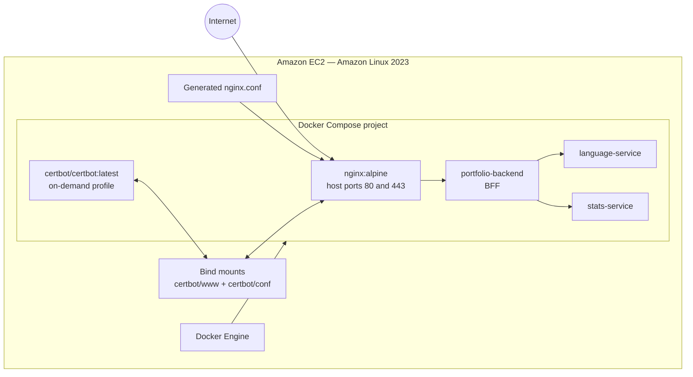

### Service catalog

| Compose service | Image expression | Network membership | Exposure | Purpose |
|---|---|---|---|---|
| `nginx` | `nginx:alpine` | `edge` | Host `80:80`, `443:443` | Redirect, ACME path, TLS termination, reverse proxy |
| `certbot` | `certbot/certbot:latest` | Compose implicit default network when run | No published port | Initial certificate request and renewal; communicates through shared files |
| `bff` | `${dockerhub_username}/portfolio-backend:${bff_version}` | `edge`, `microservices` | No host port | Single application gateway and microservice aggregator |
| `language-service` | `${dockerhub_username}/portfolio-microservices-language_service:${language_version}` | `microservices` | No host port; expected internally on `8081` | Language-related domain capability |
| `stats-service` | `${dockerhub_username}/portfolio-microservices-stats_service:${language_version}` as currently coded | `microservices` | No host port; expected internally on `8082` | Statistics aggregation through external providers |

All long-running application containers use `restart: unless-stopped`. Certbot is placed behind the `certbot` Compose profile and is invoked as a one-off container.

> The stats image currently uses `language_version` in `ec2.tf`. A separate required `stats_version` variable exists, but it is not yet wired into `local.stats_image`. See [Current implementation notes](#current-implementation-notes).

## Internal services

### Backend for Frontend

The BFF is the only application container visible to Nginx. It belongs to both custom networks and is therefore the deliberate bridge between the edge and domain layers.

Its environment is supplied through the sensitive `bff_environment` map. The current local configuration defines these service-discovery keys:

```text
LANGUAGE_SERVICE_URL=http://language-service:8081
STATS_SERVICE_URL=http://stats-service:8082
```

Docker's embedded DNS resolves the Compose service names. No private EC2 IPs are needed for container-to-container calls.

### Language service

`language-service` is attached only to `microservices`. Terraform does not publish or declare a host mapping for `8081`; the BFF URL is the runtime contract that expects the application to listen on that internal port.

### Stats service

`stats-service` is also attached only to `microservices`. It receives its own sensitive environment map, `stats_environment`. The current configuration contract contains:

| Environment key | Meaning |
|---|---|
| `SERVICES_OPGG_URL` | Base URL for the OP.GG-facing integration |
| `SERVICES_HENRIKDEV_URL` | Base URL for the HenrikDev-facing integration |
| `HENRIKDEV_API_KEY` | Credential used by the HenrikDev integration |

Actual values belong in the ignored local `terraform.tfvars`; they are intentionally not documented here.

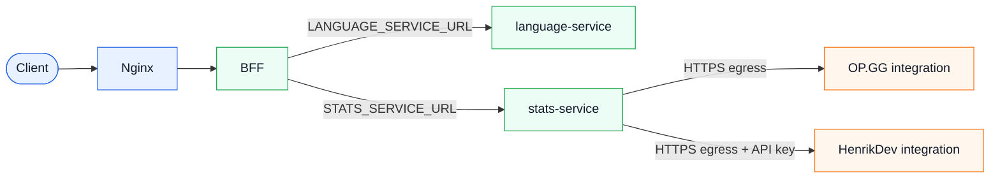

## Docker network isolation

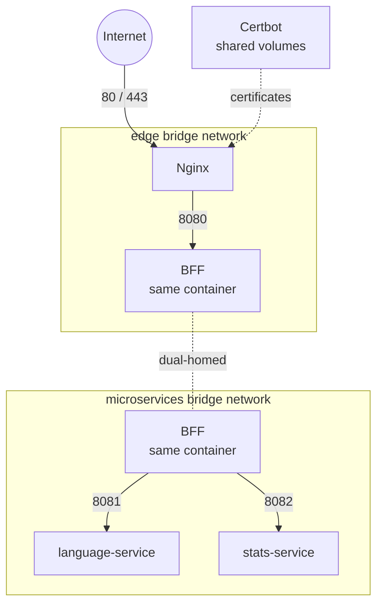

| Network | Members | Security purpose |
|---|---|---|
| `edge` | Nginx, BFF | Lets the reverse proxy reach only the application gateway |
| `microservices` | BFF, language service, stats service | Keeps domain services away from Nginx and public host ports |

This is container-level segmentation, not separate VM or VPC isolation. All containers still share one kernel and one EC2 failure domain.

## Configuration model

Terraform no longer passes a static shell file directly to EC2. `ec2.tf` composes image names and calls `templatefile()` to render `scripts/user_data.sh` with deployment-specific values.

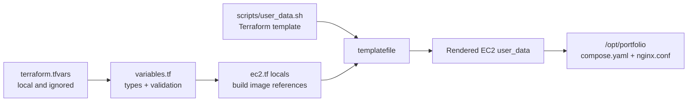

### Input variables

| Variable | Type | Default | Consumed by |
|---|---|---:|---|
| `project_name` | `string` | `portfolio` | Resource names and AWS tags |
| `aws_region` | `string` | `us-east-1` | AWS provider |
| `instance_type` | `string` | `t3.small` | EC2 instance |
| `root_volume_size` | `number` | `20` | Root volume size in GiB |
| `dockerhub_username` | sensitive `string` | required | Namespace for all application images |
| `bff_version` | `string` | required | BFF image tag |
| `language_version` | `string` | required | Language image tag; currently also used by the stats image |
| `stats_version` | `string` | required | Intended stats image tag; declared but currently unused |
| `domain_name` | `string` | required | Nginx server name and Let's Encrypt certificate name |
| `deployment_base_dir` | `string` | `/opt/portfolio` | Generated runtime files and Compose working directory |
| `docker_compose_version` | `string` | `v5.1.4` | Docker Compose CLI plugin downloaded during bootstrap |
| `bff_upstream_url` | `string` | required | Nginx upstream, normally `http://bff:8080` |
| `bff_environment` | sensitive `map(string)` | required | BFF runtime configuration and internal service URLs |
| `stats_environment` | sensitive `map(string)` | required | Stats provider URLs and credentials |

Validation currently checks Docker Hub namespace syntax, non-empty image tags, a fully qualified domain, an absolute non-root deployment path, semantic-looking Compose versions, a valid HTTP(S) BFF upstream, and valid non-empty environment variable maps.

### Complete configuration shape

The committed `terraform.tfvars.example` does not yet include the new stats fields. Until it is synchronized, use this complete shape as the reference and replace every placeholder locally:

```hcl
project_name = "portfolio"
aws_region   = "us-east-1"

instance_type    = "t3.small"
root_volume_size = 20

dockerhub_username = "replace-me"
bff_version       = "replace-me"
language_version  = "replace-me"
stats_version     = "replace-me"

domain_name = "api.example.com"

deployment_base_dir    = "/opt/portfolio"
docker_compose_version = "v5.1.4"
bff_upstream_url       = "http://bff:8080"

bff_environment = {
  LANGUAGE_SERVICE_URL = "http://language-service:8081"
  STATS_SERVICE_URL    = "http://stats-service:8082"
}

stats_environment = {
  SERVICES_OPGG_URL      = "replace-me"
  SERVICES_HENRIKDEV_URL = "replace-me"
  HENRIKDEV_API_KEY      = "replace-me"
}
```

Do not commit the real `terraform.tfvars`.

## EC2 bootstrap

The rendered `user_data` runs through cloud-init on a new instance. `set -euxo pipefail` stops the bootstrap at the first failing command and prints commands to the cloud-init log.

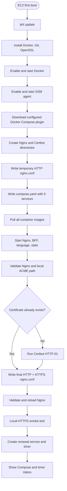

The resulting host layout is:

```text
/opt/portfolio/                         # configurable through deployment_base_dir
├── compose.yaml                        # generated; do not edit as source of truth
├── nginx/
│   └── nginx.conf                      # generated twice: HTTP bootstrap, then HTTPS
└── certbot/
    ├── conf/                           # Let's Encrypt account and certificates
    └── www/.well-known/acme-challenge/ # HTTP-01 webroot
```

Because `user_data_replace_on_change = true`, a rendered bootstrap change can cause Terraform to replace the EC2 instance. Always inspect the plan before applying a configuration or template change.

## TLS lifecycle

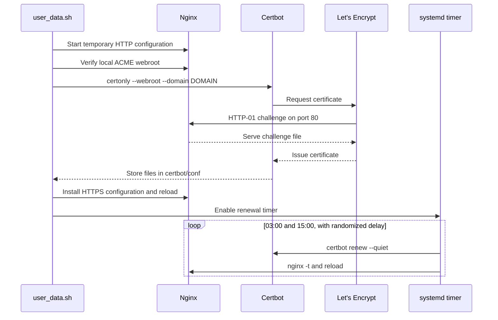

Nginx reads:

```text
/etc/letsencrypt/live/<domain_name>/fullchain.pem
/etc/letsencrypt/live/<domain_name>/privkey.pem
```

These paths are backed by the host's `certbot/conf` directory. The persistent timer checks twice daily at `03:00` and `15:00`, with up to 30 minutes of randomized delay.

The initial request uses `--register-unsafely-without-email`; no certificate-expiration email address is registered by this bootstrap.

## Security model

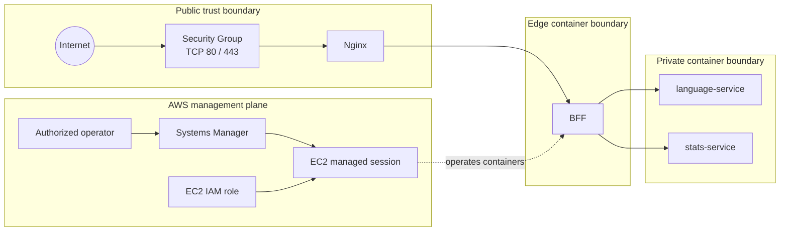

### Implemented controls

- Only TCP `80` and `443` are permitted inbound from `0.0.0.0/0`.
- There is no inbound rule for SSH `22`, no configured EC2 key pair, and no public application port `8080`, `8081`, or `8082`.
- Systems Manager Session Manager provides host administration through an EC2 IAM role.
- IMDSv2 tokens are mandatory.
- The root EBS volume is encrypted.
- Nginx terminates TLS and permits TLS `1.2` and `1.3`.
- The BFF is the only container attached to both application networks.
- `terraform.tfvars`, state files, and `.terraform/` are ignored by Git.

### Secret handling boundary

Marking `bff_environment` and `stats_environment` as Terraform `sensitive` hides values from normal CLI output, but it does not encrypt them. Their rendered values can still exist in Terraform state, EC2 user data, cloud-init artifacts, and the generated Compose file on disk.

For stronger production handling, store credentials in AWS Secrets Manager or SSM Parameter Store, grant the instance narrowly scoped read access, and retrieve them at runtime instead of interpolating them into `user_data`.

## Repository layout

```text
.
├── .gitignore
├── .terraform.lock.hcl
├── README.md
├── docs/
│   ├── architecture.png        # original single-microservice diagram
│   └── architecture-v2.png     # current diagram with stats-service
├── ec2.tf                      # AMI lookup, image locals, user_data, EC2
├── elastic_ip-.tf              # Elastic IP and EC2 association
├── iam.tf                      # EC2 role, SSM policy, instance profile
├── network.tf                  # VPC, subnet, IGW, route table
├── outputs.tf                  # instance and address outputs
├── provider.tf                 # AWS provider and default tags
├── scripts/
│   └── user_data.sh            # Terraform-rendered host bootstrap
├── security.tf                 # Security Group and rules
├── terraform.tfvars.example    # public template; currently incomplete for stats
├── variables.tf                # input declarations and validation
└── versions.tf                 # Terraform and provider constraints
```

Local `.terraform/`, `terraform.tfvars`, `terraform.tfstate`, and backup state files are intentionally omitted from the documented source tree and must remain uncommitted.

## Requirements

### Local tooling

- Terraform `>= 1.10.0`
- AWS CLI for authentication and operational commands
- An AWS identity allowed to manage VPC, EC2, Elastic IP, IAM, Security Group, and related resources
- Git for version control

Docker is not required on the workstation that runs Terraform. It is installed on EC2 by cloud-init.

### External dependencies

- A Docker Hub namespace containing the BFF, language, and stats images
- The No-IP hostname, or another DNS hostname supplied through `domain_name`
- DNS control for the hostname's A record
- Public access from EC2 to GitHub Releases, Docker Hub, Let's Encrypt, OS repositories, and the stats providers

The DNS record is not managed by Terraform.

## Configure and deploy

### 1. Authenticate with AWS

Terraform uses the standard AWS credential chain. With IAM Identity Center:

```bash
aws sso login --profile terraform
```

PowerShell:

```powershell
$env:AWS_PROFILE = "terraform"
aws sts get-caller-identity
```

Bash:

```bash
export AWS_PROFILE=terraform
aws sts get-caller-identity
```

Do not place access keys in `.tf` or `.tfvars` files.

### 2. Create local configuration

```powershell
Copy-Item terraform.tfvars.example terraform.tfvars
```

Then add the missing `stats_version`, `STATS_SERVICE_URL`, and `stats_environment` entries shown in [Complete configuration shape](#complete-configuration-shape), and replace all placeholders.

### 3. Initialize and validate

```bash
terraform init
terraform fmt -recursive
terraform validate
```

### 4. Review and apply

```bash
terraform plan
terraform apply
```

Inspect resource replacements carefully. A change in rendered `user_data` is expected to replace EC2.

### 5. Point DNS to the Elastic IP

```bash
terraform output -raw public_ip
nslookup api-portfolio.zapto.org
```

The hostname must resolve to the Elastic IP before Let's Encrypt can complete HTTP-01 validation.

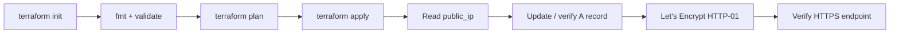

> Fresh-deployment caveat: cloud-init can reach Certbot before an externally managed DNS record has been updated to a newly allocated EIP. If issuance fails, update DNS, wait for propagation, inspect cloud-init, and then deliberately recreate or rerun the failed bootstrap. A future design should allocate/manage DNS before certificate issuance.

### 6. Verify the public endpoint

```bash
curl -I http://api-portfolio.zapto.org
curl -v https://api-portfolio.zapto.org/
```

HTTP should redirect to HTTPS. Use the hostname—not the raw IP—for TLS verification.

## Outputs

| Output | Value |
|---|---|
| `instance_id` | EC2 instance ID |
| `public_ip` | Associated Elastic IP |
| `private_ip` | EC2 private IPv4 address |
| `https_url` | `https://<elastic-ip>` in the current code |

```bash
terraform output
terraform output -raw instance_id
terraform output -raw public_ip
terraform output -raw private_ip
terraform output -raw https_url
```

The current `https_url` output is not the canonical application URL: the Let's Encrypt certificate is issued to `domain_name`, not the IP address. Prefer `https://api-portfolio.zapto.org`.

## Operations runbook

### Start a Session Manager shell

```bash
aws ssm start-session --target "$(terraform output -raw instance_id)"
```

PowerShell:

```powershell
$instanceId = terraform output -raw instance_id
aws ssm start-session --target $instanceId
```

### Check cloud-init

```bash
sudo cloud-init status --long
sudo tail -n 200 /var/log/cloud-init-output.log
```

### Check containers and logs

```bash
cd /opt/portfolio
sudo docker compose ps
sudo docker compose logs --tail=200 nginx
sudo docker compose logs --tail=200 bff
sudo docker compose logs --tail=200 language-service
sudo docker compose logs --tail=200 stats-service
```

If `deployment_base_dir` was customized, use that path instead. Add `--follow` to stream logs.

### Validate Nginx and the internal services

```bash
cd /opt/portfolio
sudo docker compose exec -T nginx nginx -t
sudo docker compose exec -T nginx wget -qO- http://bff:8080/
```

If the BFF image contains `wget`, test Docker service discovery from its network namespace:

```bash
sudo docker compose exec -T bff wget -qO- http://language-service:8081/
sudo docker compose exec -T bff wget -qO- http://stats-service:8082/
```

### Check host ports

```bash
sudo ss -lntp
```

Only Nginx should publish application ports `80` and `443` on the host.

### Inspect certificates and renewal

```bash
cd /opt/portfolio
sudo docker compose run --rm certbot certificates
sudo docker compose run --rm certbot renew --dry-run
sudo systemctl status portfolio-certbot-renew.timer --no-pager
sudo systemctl list-timers portfolio-certbot-renew.timer --all
```

### Reload Nginx safely

```bash
cd /opt/portfolio
sudo docker compose exec -T nginx nginx -t && \
sudo docker compose exec -T nginx nginx -s reload
```

## Troubleshooting

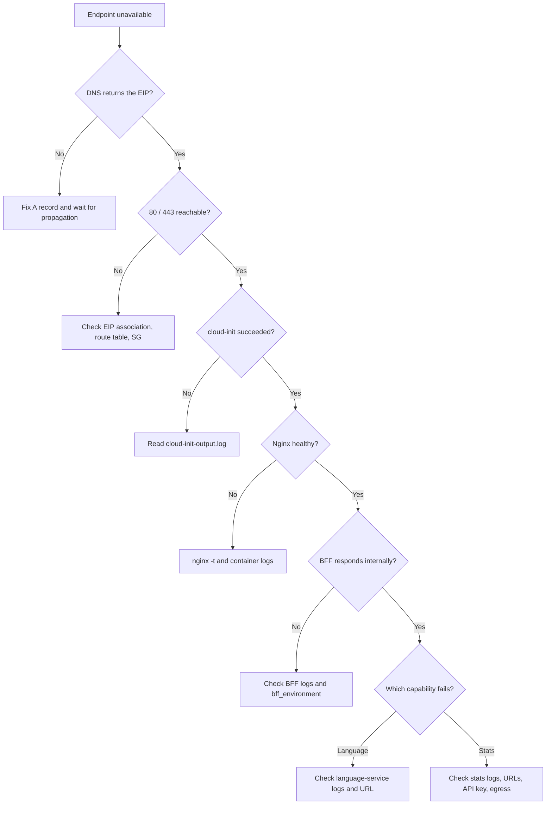

### Certificate request fails

- Confirm `domain_name` resolves publicly to `terraform output -raw public_ip`.
- Confirm TCP `80` is reachable and temporary Nginx is running.
- Confirm `/.well-known/acme-challenge/` is served from the shared webroot.
- Avoid repeated recreation that could trigger Let's Encrypt rate limits.

### Nginx returns `502 Bad Gateway`

- Confirm `bff` is running with `docker compose ps`.
- Read `docker compose logs bff nginx`.
- Verify `bff_upstream_url`, normally `http://bff:8080`.
- Confirm Nginx and BFF share `edge` and the application listens on `8080`.

### Language or stats requests fail

- Confirm the requested service is running.
- Check `LANGUAGE_SERVICE_URL` or `STATS_SERVICE_URL` in the BFF environment.
- Confirm the BFF and service share `microservices`.
- For stats, verify outbound Internet access and provider configuration without printing secrets.

### Session Manager cannot connect

- Confirm the instance is running and its instance profile is attached.
- Confirm `amazon-ssm-agent` is active.
- Confirm outbound connectivity to SSM endpoints through the Internet Gateway.
- Confirm the operator's AWS identity has Session Manager permissions.

## How changes are delivered

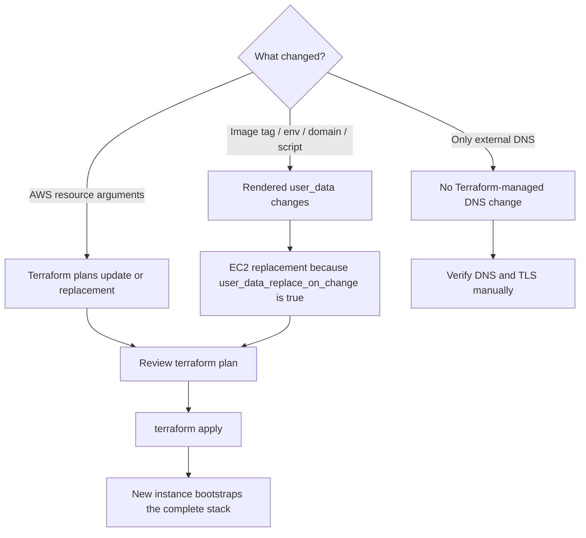

Application image upgrades are currently infrastructure deployments: changing a tag changes rendered `user_data`, which can replace the host. There is no separate CI/CD pipeline that runs `docker compose pull` on an existing instance.

Before replacing the host, account for certificate data on the root volume, EIP reassociation, DNS and ACME timing, bootstrap downtime, and any data written only to a container or the instance filesystem.

## Current implementation notes

These points describe the code exactly as it exists now and should be resolved before treating the stack as fully repeatable production infrastructure.

1. **The stats image tag is miswired.** `local.stats_image` uses `var.language_version`; `var.stats_version` is required and validated but unused.
2. **The public example is incomplete.** `terraform.tfvars.example` lacks `stats_version`, `STATS_SERVICE_URL`, and `stats_environment`, so copying it unchanged cannot satisfy all required variables.
3. **The HTTPS output uses the IP.** `https_url` should use `var.domain_name` to match the certificate.
4. **Initial DNS and ACME ordering is fragile.** DNS is external, while issuance runs during the first boot of the resource receiving the EIP.
5. **Sensitive values are rendered into user data.** Terraform's `sensitive` flag redacts display but does not provide secret storage.
6. **The state backend is local.** No remote backend, state locking, or managed state-encryption policy is declared.
7. **The generated architecture PNG is illustrative.** Mermaid diagrams and Terraform source are authoritative for exact CIDRs and dependencies.

`terraform validate` succeeds for the current configuration. A recursive formatting check reports the ignored local `terraform.tfvars`; this README update intentionally does not rewrite private local values.

## Limitations and roadmap

### Current limitations

- Single EC2 instance and single Availability Zone
- No load balancer, Auto Scaling, rolling deployment, or zero-downtime replacement
- No container health checks; `depends_on` controls start order, not readiness
- No managed database, cache, queue, or persistent application volume
- No centralized logs, metrics, tracing, dashboards, or alerting
- No WAF or application rate limiting
- No automated DNS resource
- No remote Terraform backend or CI validation pipeline
- Unpinned `nginx:alpine` and `certbot/certbot:latest` images
- Docker Compose download is not checksum-verified
- Broad Security Group egress
- Certificate account registered without an email address
- Root volume and certificate data deleted with the instance

### Suggested evolution

- [ ] Wire `stats_version` into `local.stats_image` and complete `terraform.tfvars.example`
- [ ] Change `https_url` to use `domain_name`
- [ ] Move secrets to Secrets Manager or SSM Parameter Store
- [ ] Add container health checks and dependency readiness checks
- [ ] Pin images to immutable versions or digests
- [ ] Verify the Docker Compose download checksum
- [ ] Move state to a remote encrypted backend with locking
- [ ] Manage DNS in Terraform or separate EIP allocation from bootstrap
- [ ] Add CI for formatting, validation, linting, and security scanning
- [ ] Add CloudWatch logs, metrics, alarms, and health endpoints
- [ ] Add backups or external persistence where required
- [ ] Add an ALB and multiple instances when availability warrants it
- [ ] Consider ECS or another orchestrator only when the trade-off is justified

## Design decisions

### Why one EC2 instance?

It keeps cost and operational complexity appropriate for a portfolio while still demonstrating infrastructure as code, network boundaries, TLS, IAM-based administration, and container isolation. The trade-off is one host and one failure domain.

### Why Nginx?

Nginx provides one public entry point, central TLS termination, an ACME webroot, HTTP-to-HTTPS redirection, and a stable reverse-proxy boundary.

### Why a BFF?

The BFF prevents clients from coupling directly to each microservice. It owns the public application surface, centralizes aggregation, and keeps internal services private.

### Why two Docker networks?

`edge` determines which container may receive traffic from Nginx. `microservices` determines which containers may participate in domain calls. The BFF is the only application component that needs both.

### Why Systems Manager instead of SSH?

Session Manager avoids a public SSH port, a bastion host, and EC2 key-pair distribution. AWS IAM controls access.

### Why an Elastic IP?

The external A record needs a stable address. The EIP decouples it from the instance's ordinary public IPv4 lifecycle, although `terraform destroy` also releases it.

### Why `templatefile()`?

It keeps image versions, URLs, domain settings, and environment maps in Terraform's configuration model while preserving a readable shell bootstrap. The cost is that configuration changes become EC2 lifecycle changes and sensitive values flow through state and user data.

## Author

**HotDoctor**<br>
Full Stack Developer and aspiring DevOps Engineer<br>
Esmeraldas, Ecuador<br>
arevalobernaljuan@gmail.com

---

<p align="center">
  <strong>Terraform · AWS · Docker Compose · Nginx · Let's Encrypt · BFF · Microservices</strong>
</p>
