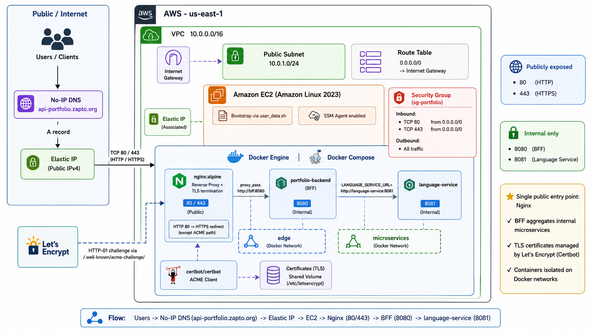
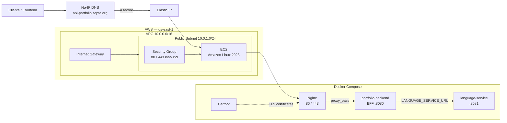
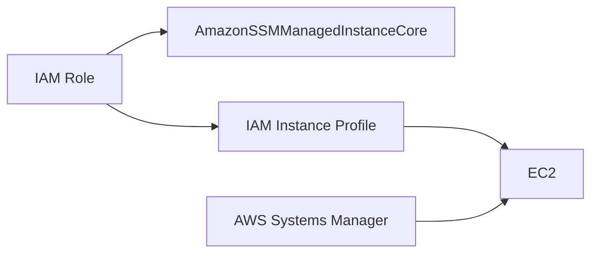
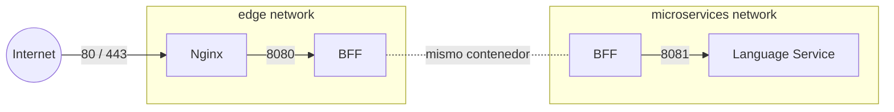
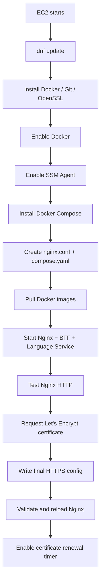

# Portfolio Backend Infrastructure — AWS + Terraform

<p align="center">
  
  
  
  
  
  
</p>

Infraestructura como código para desplegar un **backend orientado a microservicios** sobre una única instancia de Amazon EC2, utilizando Terraform para aprovisionar la red y los recursos AWS, Docker Compose para ejecutar el stack de aplicaciones, Nginx como único punto de entrada público y Let's Encrypt/Certbot para HTTPS.

El objetivo del proyecto es mantener una arquitectura sencilla de operar y suficientemente cercana a un entorno real de producción para un portafolio: red propia, IP pública estática, TLS, aislamiento entre contenedores, administración remota mediante AWS Systems Manager y un BFF que centraliza el acceso a los microservicios internos.

> **Endpoint configurado:** `https://api-portfolio.zapto.org`

---

## Tabla de contenido

- [Arquitectura](#arquitectura)
- [Flujo de una petición](#flujo-de-una-petición)
- [Componentes AWS](#componentes-aws)
- [Stack interno de la EC2](#stack-interno-de-la-ec2)
- [Redes Docker](#redes-docker)
- [HTTPS y certificados](#https-y-certificados)
- [Seguridad](#seguridad)
- [Bootstrap con user_data](#bootstrap-con-user_data)
- [Estructura del repositorio](#estructura-del-repositorio)
- [Requisitos](#requisitos)
- [Autenticación con AWS](#autenticación-con-aws)
- [Despliegue](#despliegue)
- [Variables](#variables)
- [Outputs](#outputs)
- [Operación y diagnóstico](#operación-y-diagnóstico)
- [Decisiones de diseño](#decisiones-de-diseño)
- [Limitaciones actuales](#limitaciones-actuales)
- [Mejoras futuras](#mejoras-futuras)

---

# Arquitectura



La infraestructura está organizada en tres capas principales:

1. **Entrada pública:** No-IP DNS → Elastic IP → EC2.
2. **Infraestructura AWS:** VPC, subnet pública, Internet Gateway, Security Group, IAM y EC2.
3. **Runtime interno:** Docker Compose → Nginx → BFF → microservicios.



---

# Flujo de una petición

Una llamada pública sigue este recorrido:

```text
Client
  │
  ▼
api-portfolio.zapto.org
  │
  │  A record
  ▼
Elastic IP
  │
  ▼
Amazon EC2
  │
  ▼
Nginx :443
  │
  │  proxy_pass http://bff:8080
  ▼
BFF :8080
  │
  │  LANGUAGE_SERVICE_URL=http://language-service:8081
  ▼
Language Service :8081
```

### 1. DNS

`api-portfolio.zapto.org` es administrado externamente mediante **No-IP**.

El registro utilizado es un **A record**:

```text
api-portfolio.zapto.org → Elastic IP de AWS
```

No-IP no forma parte del código Terraform actual; es una dependencia externa que debe mantenerse sincronizada con la Elastic IP.

### 2. Elastic IP

Terraform crea una `aws_eip` y la asocia directamente a la instancia EC2.

La Elastic IP actúa como la dirección IPv4 pública estable de la arquitectura mientras el recurso continúe existiendo.

### 3. Nginx

Nginx es el **único punto de entrada público del backend**.

Recibe:

- `TCP 80` para HTTP y validaciones ACME.
- `TCP 443` para HTTPS.

El tráfico normal de HTTP se redirige a HTTPS y las peticiones HTTPS son enviadas al BFF:

```nginx
proxy_pass http://bff:8080;
```

### 4. BFF

El contenedor `portfolio-backend` funciona como **Backend For Frontend**.

El BFF es accesible por Nginx dentro de la red Docker `edge`, pero su puerto `8080` no se publica en el host.

Además, el BFF tiene acceso a la red interna `microservices`, por lo que puede consumir los servicios de dominio.

### 5. Microservicios

Actualmente existe:

```text
language-service:8081
```

El BFF lo consume mediante:

```text
LANGUAGE_SERVICE_URL=http://language-service:8081
```

`language-service` no expone ningún puerto hacia Internet.

---

# Componentes AWS

## Provider

El provider AWS utiliza la región configurable mediante `var.aws_region`.

Valor por defecto:

```text
us-east-1
```

Todos los recursos reciben tags globales:

```text
Project     = portfolio
Environment = production
ManagedBy   = terraform
```

---

## VPC

Terraform crea una VPC dedicada:

```text
10.0.0.0/16
```

Con:

```hcl
enable_dns_support   = true
enable_dns_hostnames = true
```

Esto permite resolución DNS dentro de la VPC y prepara la red para servicios que dependan de nombres DNS privados.

---

## Internet Gateway

La VPC posee un **Internet Gateway** que permite conectividad entre la subnet pública e Internet.

```text
Internet
   │
   ▼
Internet Gateway
   │
   ▼
Public Route Table
   │
   ▼
Public Subnet
```

---

## Public Subnet

La instancia se ejecuta actualmente dentro de una única subnet pública:

```text
10.0.1.0/24
```

Terraform selecciona la primera Availability Zone disponible:

```hcl
availability_zone = data.aws_availability_zones.available.names[0]
```

La subnet tiene:

```hcl
map_public_ip_on_launch = true
```

Aunque EC2 recibe una IP pública al crearse, la dirección utilizada como entrada estable es la Elastic IP administrada por Terraform.

---

## Route Table

La tabla de rutas pública contiene:

```text
Destination: 0.0.0.0/0
Target:      Internet Gateway
```

Esto permite salida y entrada de tráfico público para los recursos que cumplan también las reglas del Security Group.

---

## Security Group

El Security Group permite únicamente el tráfico público necesario para Nginx:

| Dirección | Protocolo | Puerto | Origen/Destino | Uso |
|---|---:|---:|---|---|
| Inbound | TCP | `80` | `0.0.0.0/0` | HTTP + Let's Encrypt HTTP-01 |
| Inbound | TCP | `443` | `0.0.0.0/0` | HTTPS |
| Outbound | All | All | `0.0.0.0/0` | Salida de la instancia |

No existen reglas públicas para:

```text
8080
8081
```

Estos puertos pertenecen exclusivamente al tráfico interno entre contenedores.

---

## IAM y Systems Manager

La instancia utiliza un IAM Role dedicado:

```text
portfolio-ec2-role
```

Al rol se adjunta:

```text
AmazonSSMManagedInstanceCore
```

Después se crea un Instance Profile que es asociado a EC2.

Esto permite administrar la instancia mediante **AWS Systems Manager Session Manager** sin necesidad de publicar el puerto SSH `22`.



---

## EC2

La AMI de Amazon Linux 2023 no está codificada con un ID fijo.

Terraform consulta AWS Systems Manager Parameter Store:

```text
/aws/service/ami-amazon-linux-latest/al2023-ami-kernel-default-x86_64
```

De esta forma, una nueva creación utiliza una AMI actual de Amazon Linux 2023.

### Configuración por defecto

| Parámetro | Valor |
|---|---|
| OS | Amazon Linux 2023 |
| Instance type | `t3.small` |
| Root volume | `20 GB` |
| Volume type | `gp3` |
| Encryption | Enabled |
| Delete on termination | Enabled |
| IMDS | Enabled |
| IMDSv2 tokens | Required |

El volumen raíz se cifra y se elimina junto con la instancia.

La instancia también exige **IMDSv2**:

```hcl
metadata_options {
  http_endpoint = "enabled"
  http_tokens   = "required"
}
```

### Ciclo de vida

El recurso contiene:

```hcl
user_data_replace_on_change = true
```

Por lo tanto, los cambios relevantes en `scripts/user_data.sh` pueden provocar el reemplazo de la instancia, permitiendo reconstruir el entorno desde un bootstrap limpio.

La AMI está incluida en:

```hcl
lifecycle {
  ignore_changes = [ami]
}
```

Esto evita reemplazar una instancia existente únicamente porque el parámetro de Amazon Linux haya avanzado a una AMI más nueva.

---

## Elastic IP

```hcl
resource "aws_eip" "portfolio"
```

La EIP se asocia directamente a:

```text
aws_instance.portfolio
```

y depende del Internet Gateway.

Su función es desacoplar el endpoint público del ciclo de vida normal de una IP pública dinámica de EC2.

> Si se ejecuta un `terraform destroy` completo, la Elastic IP también será destruida. Un deployment posterior puede obtener otra dirección, por lo que el A record de No-IP deberá actualizarse.

---

# Stack interno de la EC2

La EC2 no ejecuta los backends directamente como procesos del sistema.

El stack se ejecuta sobre:

```text
Amazon Linux 2023
└── Docker Engine
    └── Docker Compose
        ├── nginx
        ├── certbot
        ├── portfolio-backend
        └── language-service
```

## Contenedores

| Servicio | Imagen | Puerto | Exposición |
|---|---|---:|---|
| Nginx | `nginx:alpine` | `80`, `443` | Pública |
| Certbot | `certbot/certbot:latest` | — | Interna / ejecución puntual |
| BFF | `hotdoctor/portfolio-backend:latest` | `8080` | Docker interno |
| Language Service | `hotdoctor/portfolio-microservices-language_service:latest` | `8081` | Docker interno |

---

# Redes Docker

La arquitectura utiliza dos redes bridge.



## `edge`

Conecta:

```text
nginx
bff
```

Su propósito es permitir que Nginx alcance al BFF sin publicar `8080` en EC2.

## `microservices`

Conecta:

```text
bff
language-service
```

Los microservicios quedan aislados del reverse proxy y del tráfico público.

El BFF pertenece a ambas redes porque actúa como puente lógico entre la capa de entrada y la capa de servicios.

---

# HTTPS y certificados

La terminación TLS ocurre en **Nginx**.

El backend no necesita gestionar certificados directamente.

```text
Client
   │
   │ HTTPS
   ▼
Nginx
   │
   │ HTTP dentro de Docker
   ▼
BFF
```

## Emisión inicial

El bootstrap primero inicia Nginx únicamente por HTTP.

Nginx expone:

```text
/.well-known/acme-challenge/
```

Certbot utiliza el método:

```text
HTTP-01 / webroot
```

y comparte con Nginx:

```text
./certbot/www
./certbot/conf
```

Cuando Let's Encrypt entrega el certificado, Nginx pasa a utilizar:

```text
/etc/letsencrypt/live/api-portfolio.zapto.org/fullchain.pem
/etc/letsencrypt/live/api-portfolio.zapto.org/privkey.pem
```

Después:

```text
HTTP :80  → 301 → HTTPS
HTTPS :443 → BFF
```

## Renovación

El bootstrap crea:

```text
portfolio-certbot-renew.service
portfolio-certbot-renew.timer
```

El timer intenta la renovación dos veces al día:

```text
03:00
15:00
```

con:

```text
RandomizedDelaySec=30m
```

Después de una ejecución de Certbot se valida y recarga Nginx.

---

# Seguridad

La arquitectura aplica varias medidas de reducción de superficie de ataque.

### Solo 80 y 443 son públicos

```text
Internet
 ├── 80  → Nginx
 └── 443 → Nginx
```

Los servicios internos no publican sus puertos en EC2.

### No se requiere SSH público

No existe una regla inbound para:

```text
22/tcp
```

La administración se realiza mediante AWS Systems Manager.

### IMDSv2 obligatorio

EC2 exige tokens para consultar Instance Metadata Service.

### Disco cifrado

El root volume `gp3` está configurado con:

```hcl
encrypted = true
```

### Segmentación de contenedores

Nginx no comparte directamente la red `microservices`.

```text
Nginx
  │ edge
  ▼
 BFF
  │ microservices
  ▼
Services
```

Esto mantiene el BFF como única puerta lógica hacia los microservicios.

### Terraform state y variables

`.gitignore` excluye:

```text
*.tfstate
*.tfstate.*
*.tfvars
*.tfvars.json
.terraform/
```

Los archivos con estado y valores potencialmente sensibles no deben versionarse.

---

# Bootstrap con `user_data`

Terraform entrega:

```text
scripts/user_data.sh
```

a EC2 mediante:

```hcl
user_data = file("${path.module}/scripts/user_data.sh")
```

El script se ejecuta a través de cloud-init durante el primer arranque.

## Secuencia



El script utiliza:

```bash
set -euxo pipefail
```

por lo que un error durante el bootstrap detiene la ejecución. Esto evita continuar silenciosamente con una instalación incompleta.

---

# Estructura del repositorio

```text
portfolio-arq-terraform/
│
├── .gitignore
├── .terraform.lock.hcl
│
├── provider.tf
├── versions.tf
├── variables.tf
├── outputs.tf
│
├── network.tf
├── security.tf
├── iam.tf
├── ec2.tf
├── elastic_ip-.tf
│
└── scripts/
    └── user_data.sh
```

## Responsabilidad de cada archivo

| Archivo | Responsabilidad |
|---|---|
| `versions.tf` | Versión mínima de Terraform y provider AWS |
| `provider.tf` | Región y tags globales |
| `variables.tf` | Parámetros configurables |
| `network.tf` | VPC, subnet, Internet Gateway y route table |
| `security.tf` | Security Group y reglas 80/443 |
| `iam.tf` | IAM Role, policy attachment e Instance Profile |
| `ec2.tf` | AMI, EC2, storage, metadata y user data |
| `elastic_ip-.tf` | Elastic IP asociada a EC2 |
| `outputs.tf` | IDs, IPs y endpoint de salida |
| `scripts/user_data.sh` | Bootstrap del runtime Docker/Nginx/Certbot |
| `.gitignore` | Evita versionar state, tfvars y archivos locales |

---

# Requisitos

## Locales

- Terraform `>= 1.10.0`
- AWS CLI configurado
- Credenciales AWS válidas o AWS IAM Identity Center/SSO
- Acceso suficiente para crear VPC, EC2, EIP, IAM, Security Groups y recursos relacionados

El provider está fijado actualmente a:

```text
hashicorp/aws 6.60.0
```

Docker **no** es un requisito en la máquina desde la que se ejecuta Terraform; Docker se instala dentro de EC2 mediante `user_data.sh`.

## Externo

Debe existir el hostname:

```text
api-portfolio.zapto.org
```

con un A record apuntando a la Elastic IP.

Este DNS actualmente **no está administrado por Terraform**.

---

# Autenticación con AWS

Terraform utiliza la credential chain estándar de AWS.

Un flujo recomendado con IAM Identity Center es:

```bash
aws sso login --profile terraform
```

### PowerShell

```powershell
$env:AWS_PROFILE="terraform"
```

### Bash

```bash
export AWS_PROFILE=terraform
```

Verificación:

```bash
aws sts get-caller-identity
```

No es necesario almacenar Access Keys dentro de los archivos `.tf`.

---

# Despliegue

## 1. Inicializar

```bash
terraform init
```

## 2. Formatear

```bash
terraform fmt -recursive
```

## 3. Validar

```bash
terraform validate
```

## 4. Revisar el plan

```bash
terraform plan
```

## 5. Aplicar

```bash
terraform apply
```

## 6. Consultar outputs

```bash
terraform output
```

Ejemplo:

```bash
terraform output -raw public_ip
```

## 7. DNS

Verifica que:

```text
api-portfolio.zapto.org
```

resuelva a la misma IP mostrada por:

```bash
terraform output -raw public_ip
```

Puedes comprobarlo con:

```bash
nslookup api-portfolio.zapto.org
```

## 8. Endpoint

La URL de aplicación configurada es:

```text
https://api-portfolio.zapto.org
```

---

# Variables

| Variable | Default | Uso actual |
|---|---|---|
| `project_name` | `portfolio` | Nombres y tags |
| `aws_region` | `us-east-1` | Provider AWS |
| `instance_type` | `t3.small` | EC2 |
| `root_volume_size` | `20` | Root volume |
| `dockerhub_username` | sin default | Declarada; no consumida actualmente por `user_data.sh` |
| `bff_version` | `latest` | Declarada; imagen actual está hardcodeada a `latest` |
| `language_version` | `latest` | Declarada; imagen actual está hardcodeada a `latest` |
| `domain_name` | `_` | Declarada; el dominio está hardcodeado en `user_data.sh` |

> Las últimas cuatro variables muestran una oportunidad clara de refactor: pasar valores desde Terraform hacia `user_data.sh` mediante `templatefile()` o variables de entorno generadas por Terraform.

---

# Outputs

Terraform expone:

| Output | Contenido |
|---|---|
| `instance_id` | ID de EC2 |
| `public_ip` | Elastic IP |
| `private_ip` | IP privada de EC2 |
| `https_url` | URL construida actualmente con la Elastic IP |

Ejemplo:

```bash
terraform output instance_id
terraform output public_ip
terraform output private_ip
terraform output https_url
```

> **Importante:** el certificado TLS se emite para `api-portfolio.zapto.org`, no para la dirección IP. Para tráfico HTTPS real debe preferirse `https://api-portfolio.zapto.org`. El output `https_url` actual utiliza la EIP y sería conveniente cambiarlo en el futuro para devolver el dominio.

---

# Operación y diagnóstico

## Estado de cloud-init

```bash
sudo cloud-init status --long
```

Esperado:

```text
status: done
```

Logs:

```bash
sudo tail -f /var/log/cloud-init-output.log
```

Si el bootstrap falla, este es el primer lugar que debe revisarse.

---

## Contenedores

```bash
sudo docker compose \
  -f /opt/portfolio/compose.yaml \
  ps
```

---

## Validar Nginx

```bash
sudo docker compose \
  -f /opt/portfolio/compose.yaml \
  exec nginx nginx -t
```

---

## Logs de Nginx

```bash
sudo docker compose \
  -f /opt/portfolio/compose.yaml \
  logs nginx
```

---

## Validar puertos

```bash
sudo ss -lntp | grep -E ':80|:443'
```

---

## Probar HTTPS

```bash
curl -v https://api-portfolio.zapto.org
```

---

## Certificados

```bash
sudo ls -la \
  /opt/portfolio/certbot/conf/live/api-portfolio.zapto.org/
```

---

## Timer de renovación

```bash
sudo systemctl status portfolio-certbot-renew.timer
```

Listado:

```bash
sudo systemctl list-timers
```

---

## Acceso mediante SSM

Obtén el ID:

```bash
terraform output -raw instance_id
```

y abre una sesión:

```bash
aws ssm start-session --target <INSTANCE_ID>
```

---

# Decisiones de diseño

## ¿Por qué Nginx?

Nginx concentra las responsabilidades de infraestructura HTTP:

- punto de entrada público;
- reverse proxy;
- TLS termination;
- redirección HTTP → HTTPS;
- exposición del challenge ACME;
- separación entre Internet y el BFF.

El backend puede mantenerse enfocado en lógica de aplicación.

---

## ¿Por qué un BFF?

El BFF evita exponer directamente cada microservicio.

```text
Internet
   │
   ▼
 Nginx
   │
   ▼
  BFF
   │
   ├── Language Service
   ├── Future Service A
   └── Future Service B
```

Esto permite centralizar en el futuro:

- autenticación;
- autorización;
- composición de respuestas;
- manejo de errores;
- políticas comunes;
- routing de aplicación.

---

## ¿Por qué dos redes Docker?

`edge` y `microservices` separan responsabilidades.

```text
edge:
Nginx ↔ BFF

microservices:
BFF ↔ servicios internos
```

Nginx no necesita acceso directo a cada microservicio.

---

## ¿Por qué Systems Manager?

SSM elimina la necesidad de abrir SSH al mundo.

La administración queda separada del tráfico de aplicación y controlada mediante IAM.

---

## ¿Por qué Elastic IP?

La IP pública automática de EC2 no debe ser el identificador estable del backend.

La EIP proporciona un endpoint IPv4 estable para el A record de No-IP mientras el recurso exista.

---

# Limitaciones actuales

Esta arquitectura es deliberadamente simple y está pensada como una infraestructura de portafolio / single-node.

Actualmente **no** incluye:

- alta disponibilidad;
- múltiples Availability Zones;
- Auto Scaling;
- Application Load Balancer;
- ECS/EKS;
- subnet privada para workloads;
- NAT Gateway;
- WAF;
- CloudFront;
- observabilidad centralizada;
- health checks de Docker Compose;
- gestión automática de No-IP desde Terraform;
- backend remoto para Terraform state.

También existen algunos detalles de implementación que pueden refactorizarse:

1. El dominio está hardcodeado en `user_data.sh`.
2. Las imágenes Docker usan `latest` de forma directa.
3. `dockerhub_username`, `bff_version`, `language_version` y `domain_name` no están conectadas al bootstrap.
4. `https_url` utiliza la EIP en vez del hostname TLS.
5. Un `terraform destroy` completo elimina la EIP; el A record externo deberá actualizarse si la IP cambia.
6. La emisión inicial de Let's Encrypt depende de que No-IP ya resuelva correctamente hacia la EIP.

Estas limitaciones son aceptables para el objetivo actual, pero marcan claramente el camino de evolución hacia una arquitectura distribuida.

---

# Mejoras futuras

Una evolución natural del proyecto podría incluir:

- [ ] parametrizar dominio e imágenes Docker desde Terraform;
- [ ] fijar versiones de imágenes en lugar de depender de `latest`;
- [ ] mover Terraform state a un backend remoto;
- [ ] automatizar el DNS o migrarlo a Route 53;
- [ ] incorporar health checks a los contenedores;
- [ ] añadir logs y métricas centralizadas;
- [ ] integrar CI/CD;
- [ ] añadir más microservicios a la red `microservices`;
- [ ] evolucionar de una única EC2 hacia ECS/Fargate o una arquitectura con Load Balancer;
- [ ] distribuir workloads entre múltiples Availability Zones;
- [ ] añadir gestión de secretos mediante AWS Secrets Manager o SSM Parameter Store.

---

# Resumen

La arquitectura actual implementa un pipeline completo desde Internet hasta los microservicios internos:

```text
No-IP DNS
    │
    ▼
Elastic IP
    │
    ▼
AWS VPC
    │
    ▼
Public Subnet
    │
    ▼
Security Group
    │
    ▼
Amazon EC2
    │
    ▼
Docker Engine
    │
    ▼
Nginx :443
    │
    ▼
BFF :8080
    │
    ▼
Microservices :8081+
```

Terraform es responsable de la infraestructura AWS; `user_data.sh` convierte la EC2 recién creada en el runtime de la aplicación; Docker Compose mantiene los servicios; Nginx controla la entrada pública; Certbot administra TLS; SSM permite operar la instancia sin SSH público; y el BFF mantiene a los microservicios aislados de Internet.

---

<p align="center">
  <strong>Terraform · AWS · Docker · Nginx · Let's Encrypt · Microservices</strong>
</p>

---

# Author

**Juan Arévalo**  
Full Stack Developer & Future Desarrollador DevOps :P  
📍 Esmeraldas, Ecuador  
✉️ arevalobernaljuan@gmail.com

